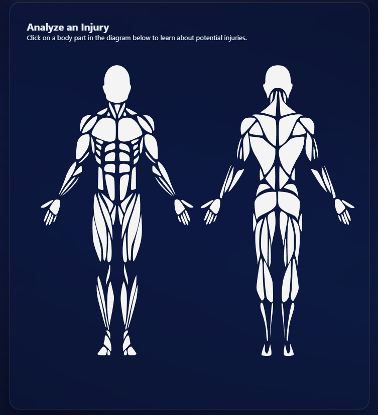
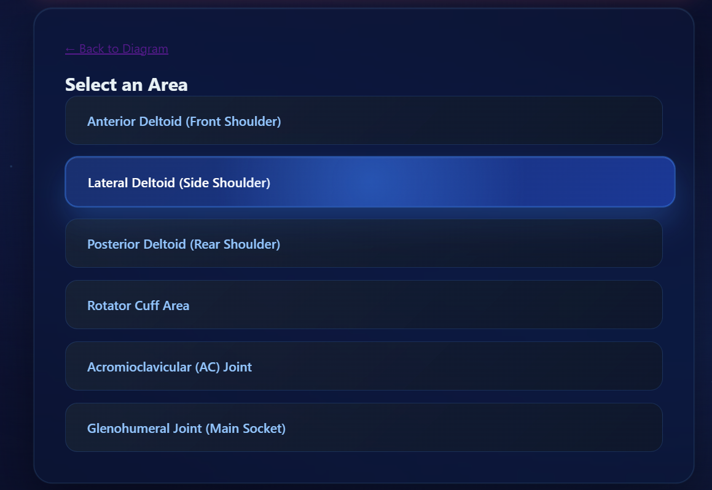
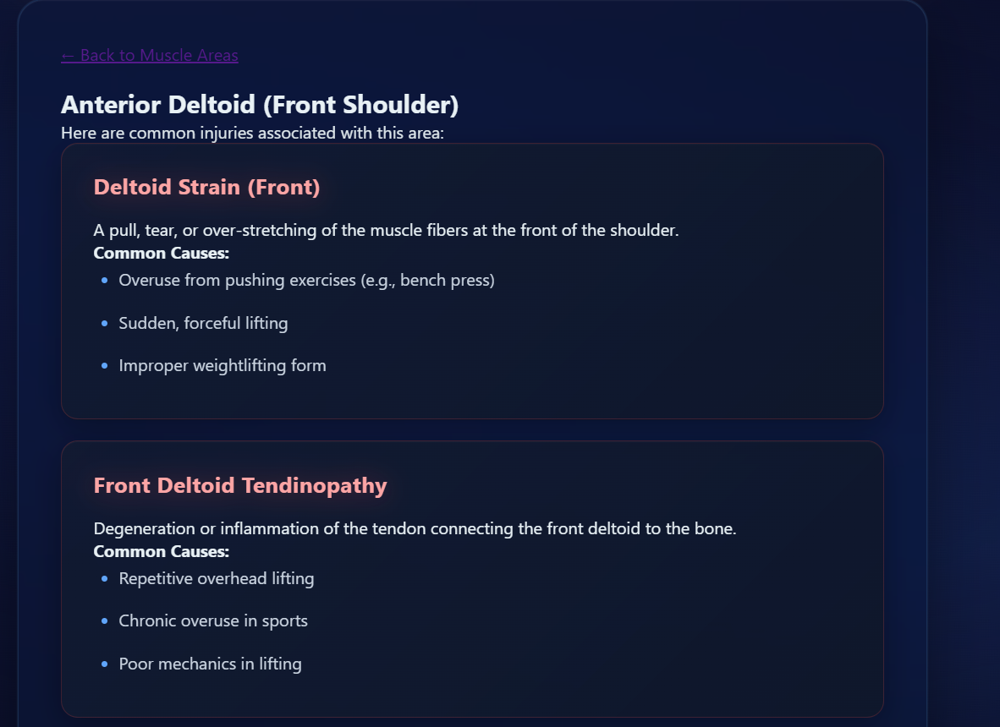
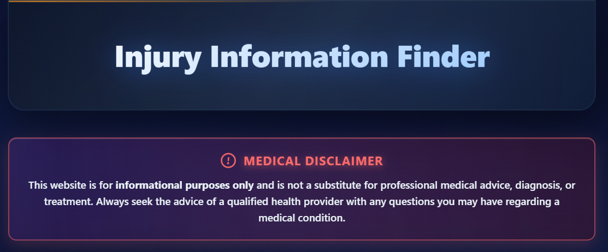

# Injury Information Finder

This is a simple React application that allows users to click on an interactive anatomy diagram to learn about potential injuries in different muscle groups.

## Description

The application presents an SVG-based anatomy diagram. Users can hover over different body parts, which are then highlighted. Clicking on a body part takes the user to a more detailed page listing specific sub-muscles. From there, the user can select a sub-muscle to view a list of possible injuries, their descriptions, and common causes.

## Features

### Anatomy Diagram
The application starts with a full anatomy diagram. The user can interact with different body parts.



### Close-Up Look and Highlighting
When the user hovers over a body part, it gets highlighted, providing a close-up look at the muscle group.


### Area Selection
After clicking a body part, the user is directed to a page where they can select a specific area of that muscle group.



### Detailed Information
The application provides detailed information about potential injuries for the selected muscle area, including common causes.



### Medical Disclaimer
A clear medical disclaimer is displayed to ensure users understand the information is not a substitute for professional medical advice.



## Getting Started

To run this project locally, follow these steps:

1.  **Clone the repository:**
    ```bash
    git clone <repository-url>
    ```
2.  **Navigate to the project directory:**
    ```bash
    cd injury-finder
    ```
3.  **Install dependencies:**
    ```bash
    npm install
    ```
4.  **Start the development server:**
    ```bash
    npm start
    ```
    This will open the application in your default web browser at `http://localhost:3000`.

## Tech Stack

*   **React:** A JavaScript library for building user interfaces.
*   **React Router:** For handling routing within the application.
*   **JavaScript (ES6+):** The primary programming language.
*   **CSS:** For styling the application.
<<<<<<< HEAD

## Disclaimer

This application is for informational purposes only and is not a substitute for professional medical advice, diagnosis, or treatment. Always seek the advice of your physician or other qualified health provider with any questions you may have regarding a medical condition.
=======
>>>>>>> fc935e5cf4860ce3afd8914ce0b89fd61aa1cdc8
